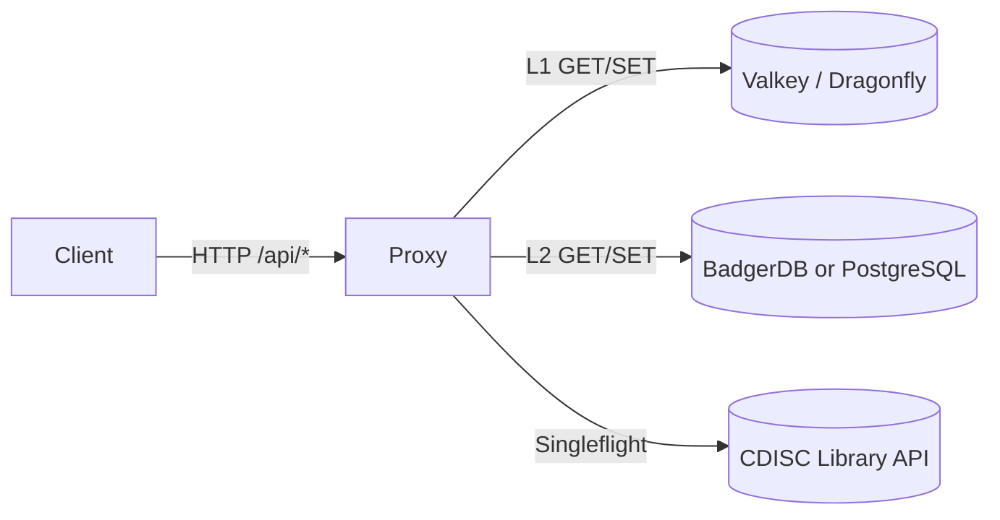
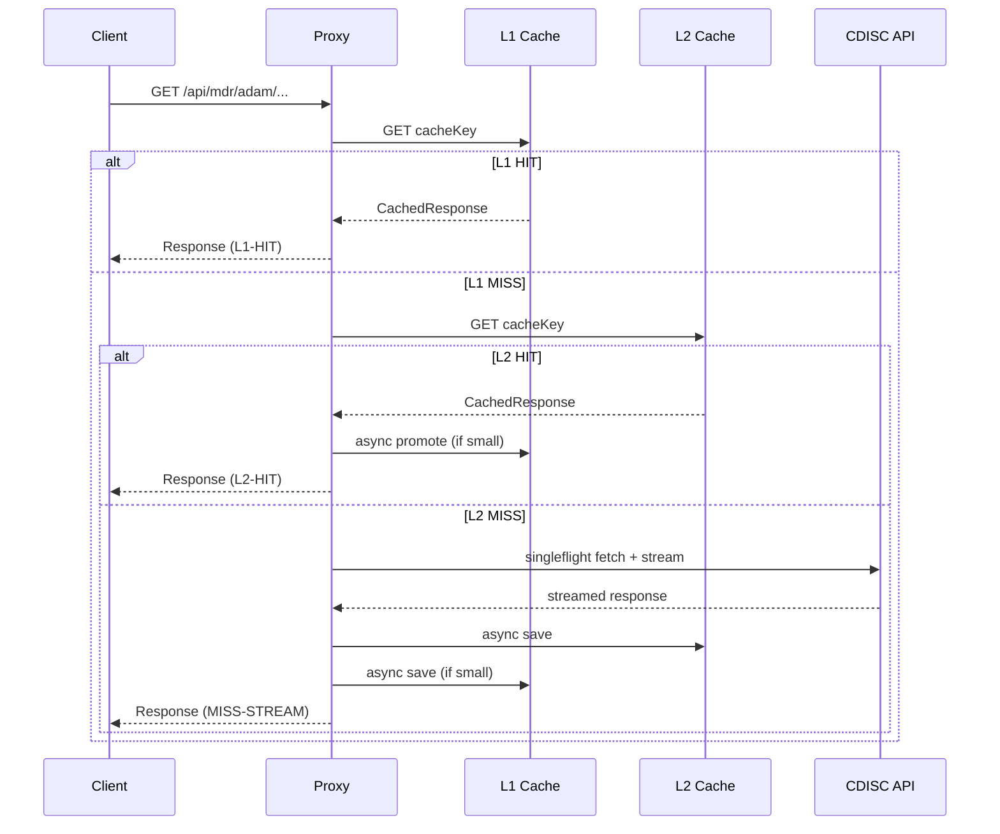
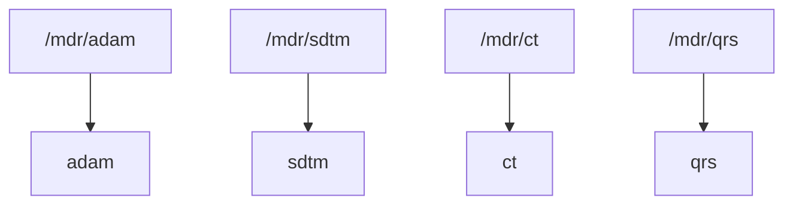
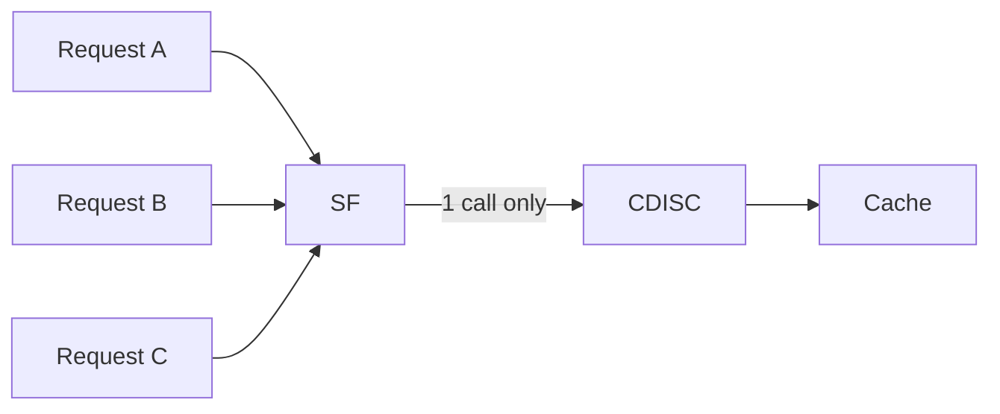
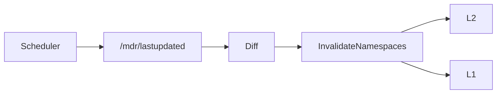

# ARCHITECTURE.md

## Overview

This service is a **high-throughput, read-only caching proxy** in front of the **CDISC Library API**.
It is explicitly designed to:

- Protect CDISC from request storms
- Absorb large payloads (up to 100 MB)
- Deduplicate concurrent upstream requests
- Provide deterministic invalidation based on `/mdr/lastupdated`
- Remain operational even when CDISC is slow or flaky

This is **not** a generic HTTP proxy. It is a **domain-aware API cache**.

---

## High-Level Architecture



**Read path priority**:
1. L1 (in-memory, fastest)
2. L2 (durable, large objects)
3. CDISC upstream (slow, expensive)

---

## Request Lifecycle (Detailed)



---

## Cache Tiers

### L1 Cache (Valkey / Dragonfly)

Purpose:
- Ultra-low latency
- Shield L2 and CDISC from burst traffic

Characteristics:
- TTL-based
- Object size capped at **2 MB**
- Stores serialized `CachedResponse`

Failure mode:
- Safe to lose entirely
- Rebuilt from L2/CDISC

---

### L2 Cache (BadgerDB or PostgreSQL)

Purpose:
- Durable cache
- Large object storage (up to 100 MB)

Two implementations:

#### BadgerDB
- Embedded
- TTL-native
- Key-encoded namespaces
- Value-log GC

#### PostgreSQL
- Shared / multi-node friendly
- Explicit cleanup job
- `product_group` column for invalidation

---

## Namespace Awareness



Namespaces are extracted from the URL path and used to:
- Build cache keys
- Group invalidations
- Map CDISC domains → product groups

---

## Cache Key Structure

```
cdisc:cache:<namespace>:<request_uri>
```

Examples:
```
cdisc:cache:adam:/mdr/adam/datasets
cdisc:cache:ct:/mdr/ct/packages
```

---

## Singleflight Protection



Guarantees:
- One upstream request per unique key
- Followers block, then read cache
- Prevents CDISC request storms

---

## Streaming + Capture Hybrid

Why this exists:
- Responses can be huge
- Clients should not wait for full buffering

Mechanism:
- `io.TeeReader`
- Stream to client
- Capture buffer up to `maxResponseSize`
- Persist after stream completes

Failure handling:
- Client still receives streamed data
- Cache save happens asynchronously

---

## Negative Caching

Non-200 responses:
- Cached with **short TTL**
- Prevents hammering broken endpoints
- Propagated with `Cache-Control: no-store`

TTL used:
```
negativeCacheTTL = 5 minutes
```

---

## Scheduler & Invalidation



Rules:
- Domain-level changes map to namespaces
- `overall` change nukes everything
- L1 + L2 invalidated together

---

## Health Endpoint

`GET /health`

Checks:
- L1 ping
- L2 ping
- CDISC lightweight endpoint

Caching:
- Health result cached in L1 for 1 minute

Status levels:
- `healthy`
- `degraded` (persistent upstream failure)

---

## Concurrency & Backpressure

- `singleflight.Group`: upstream dedupe
- `l2Sem`: limits concurrent L2 writes
- Context timeouts everywhere
- Graceful shutdown with waitgroup + timeout

---

## Failure Philosophy

This system prefers:
- Serving **stale-but-valid** data
- Over failing requests
- Over retry storms

If CDISC is slow:
- Cache absorbs load
- Health degrades
- Service stays online

---

## What This Is NOT

- ❌ Not a general reverse proxy
- ❌ Not a write-through API
- ❌ Not eventually-consistent storage

It is a **defensive, domain-aware cache wall**.

---

## TL;DR

```
Fast paths are cheap
Slow paths are protected
Upstream is respected
Failures are contained
```
