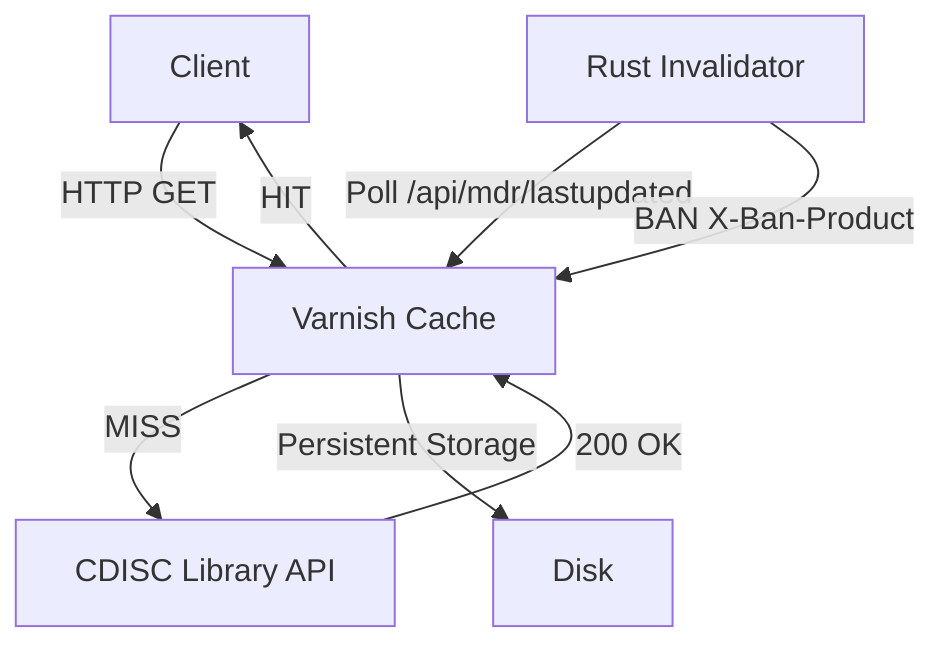

# CDISC Cache Proxy (a.k.a. *I Gave Up and Chose Wisdom*)

> **TL;DR**: I tried to write my own proxy. It was bad. Varnish is good. This project is the result of personal growth.

---

## What Is This?

This repository provides a **high‑performance, persistent caching layer** for the **CDISC Library API**, powered by **Varnish** and supervised by a small but vigilant **Rust invalidator daemon**.

The goal is simple:

- Cache *everything* aggressively (years, not minutes)
- Never serve stale CDISC metadata
- Avoid hammering `library.cdisc.org`
- Sleep well at night

---

## A Short, Painful History

Originally, this project was going to be:

> *"A clean, elegant, custom-written HTTP proxy with smart cache invalidation logic."*

Reality check:

- HTTP caching is **hard**
- Edge cases breed faster than rabbits
- I was slowly re‑implementing **Varnish**, but worse
- Debugging my own proxy at 02:00 was a character‑building experience

At some point I asked myself:

> *"Why am I recreating a battle‑tested, industry‑standard cache written by people who actually enjoy pain?"*

So I stopped.

I abandoned my proxy ambitions, embraced humility, and let **Varnish** do what Varnish does best.

This repository is what happens **after** accepting reality.

---

## Architecture (a.k.a. Doing Things the Sensible Way)

```
Client
  │
  ▼
Varnish (persistent cache, TTLs measured in years)
  │
  ▼
CDISC Library API
```

Alongside Varnish:

```
Rust Invalidator
  ├─ Polls /api/mdr/lastupdated
  ├─ Detects product changes
  └─ Issues precise BANs to Varnish
```

No magic. No heuristics. Just dates, comparisons, and righteous cache invalidation.

---

## Why Varnish Won (Decisively)

Because Varnish:

- Has **persistent storage** (survives restarts)
- Handles **HTTP semantics correctly**
- Supports **BANs** (the right way to invalidate large caches)
- Is absurdly fast
- Has already solved problems I hadn’t even discovered yet

Meanwhile, my proxy:

- Had bugs
- Needed documentation
- Needed tests
- Needed therapy

Varnish didn’t.

---

## What This Project Actually Contains

```
.
├── Cargo.lock                 # Rust dependencies, frozen in time
├── Cargo.toml                 # The Rust invalidator manifest
├── cdisc_proxy.vcl            # Varnish VCL (the real hero)
├── LICENCE                    # MIT, because of course
├── README.md                  # You are here
├── SETUP_GUIDE.md             # The boring but necessary part
├── setup_script.sh            # Automation, because typing is overrated
├── src/
│   └── main.rs                # The Rust invalidator daemon
└── test_persistence.sh        # Proof that cache survives reboots
```

---

## Badges of Questionable Achievement


---

## Key Features

- **6‑year cache TTL** for stable CDISC content
- **Persistent cache storage** (disk‑backed, not wishful thinking)
- **Targeted invalidation** by product group
- **Zero downtime** VCL reloads
- **Docker, systemd, OpenRC** support
- **Minimal Rust code** that does one thing and does it well

---

## How Cache Invalidation Works (Without Drama)

1. Rust daemon polls `/api/mdr/lastupdated`
2. Compares timestamps with previous state
3. Detects which product groups changed
4. Sends `BAN` requests with `X-Ban-Product`
5. Varnish nukes only the affected cache entries

No global purges. No collateral damage.

---

## The Fallen Custom Proxy (Fake Postmortem)

### Incident Summary

- **Service**: Hand-rolled CDISC HTTP proxy
- **Status**: Deceased
- **Time of Death**: Somewhere between "just one more edge case" and "why is this header here"
- **Cause of Death**: Reimplementation of HTTP semantics without adult supervision

### What Went Wrong

- Incorrect caching of error responses ("it *worked* until it didn’t")
- Header normalization bugs that only appeared on Tuesdays
- Cache invalidation logic that slowly evolved into philosophy
- An alarming amount of code dedicated to things Varnish already solved in 2006

### What Went Right

- We learned when to stop
- No customers were harmed (because no one used it)
- The Rust compiler tried to warn us

### Root Cause

> *"I can totally write a better proxy."*

### Resolution

- Terminated the proxy with dignity
- Replaced it with Varnish
- Added a Rust invalidator that knows its place

### Action Items

- ❌ Do not resurrect the proxy
- ✅ Use battle-tested infrastructure
- ✅ Document the lesson publicly as a warning to others

---

## Who This Is For

- People tired of waiting for CDISC pages to load
- Regulated environments that want **predictable behaviour**
- Anyone who understands that *"just write a proxy"* is a trap

---

## Who This Is Not For

- People who enjoy re‑implementing HTTP
- Those allergic to Varnish
- Anyone who thinks caching is "just set max‑age"

---

## Setup

Read **SETUP_GUIDE.md**.

Yes, it’s long.

No, you can’t skip it.

---

## License

MIT License.

Do whatever you want:

- Use it
- Fork it
- Improve it
- Laugh at my abandoned proxy idea

Just don’t blame me when your cache is *too fast*.

---

## Mascots (For Morale)

Because every serious infrastructure project needs mascots.

### The Badger — Varnish

- Digs deep
- Lives underground
- Extremely territorial about its cache
- Will fight you if you try to invalidate incorrectly

```
  /\_/\
 ( o.o )   < Badger: "Cache is correct. You are not."
  > ^ <
```

### The Raccoon — The Abandoned Proxy

- Curious
- Resourceful
- Absolutely should not be touching production traffic
- Now lives in the documentation where it can’t hurt anyone

```
 (\__/)
 (='.'=)  < Raccoon: "What if we just ignore Cache-Control?"
 (")_(")
```

---

## Final Words

## Lessons Learned (Paid For With Time)

1. **HTTP is not a weekend project**  
   Every time you think you’ve handled all the edge cases, HTTP invents three more and a new RFC.

2. **Caching is easy until it matters**  
   It works perfectly right up until the moment correctness, persistence, headers, and invalidation are required.

3. **Reinventing infrastructure is a cry for help**  
   If your design doc starts to resemble Varnish internals, stop. That way lies madness.

4. **Battle‑tested beats clever**  
   Varnish has survived production traffic, abuse, and humans. My proxy had survived optimism.

5. **Minimal glue > maximal ambition**  
   A small Rust daemon issuing BANs is infinitely better than a bespoke proxy pretending to be a cache.

6. **Ego is not a scalability strategy**  
   Accepting reality is cheaper than debugging your own HTTP stack forever.

---

## Architecture Diagram (Visual Aid for the Skeptical)



---

## Final Words

Sometimes the most senior engineering decision is knowing when to stop being clever.

I stopped.

Varnish didn’t.

You’re welcome.


<div align="center">
🦡 Powered by Badgers. 🦝 Guarded by Racoons. Deployed by Enthusiasts. Made with ❤️ for the clinical research community.
</div>
